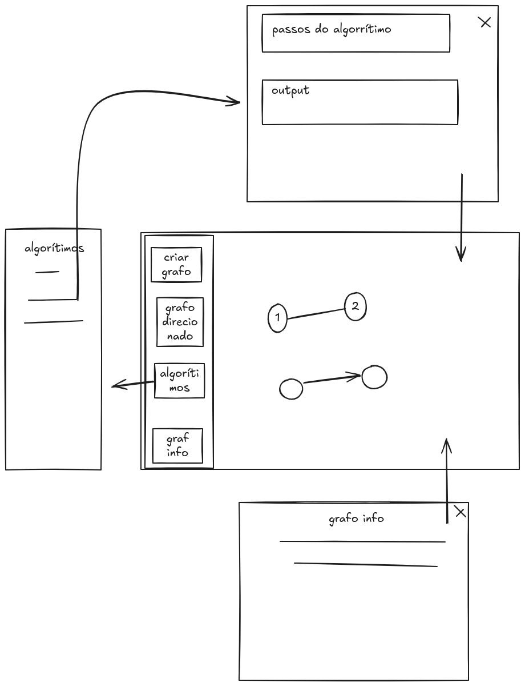

# Projeto de Algorítimos em Grafos

Esse projeto foi fundado com a intenção de entender, estudar e aprimorar nosso entendimento sobre estruturas em grafos da matéria Algorítimos em grafos do professor Marco do Cefet/rj unidade Nova Friburgo. Dessa forma, o programa pode criar grafos

## Base Image Front End

## Arquitetura front-end

// A fazer
