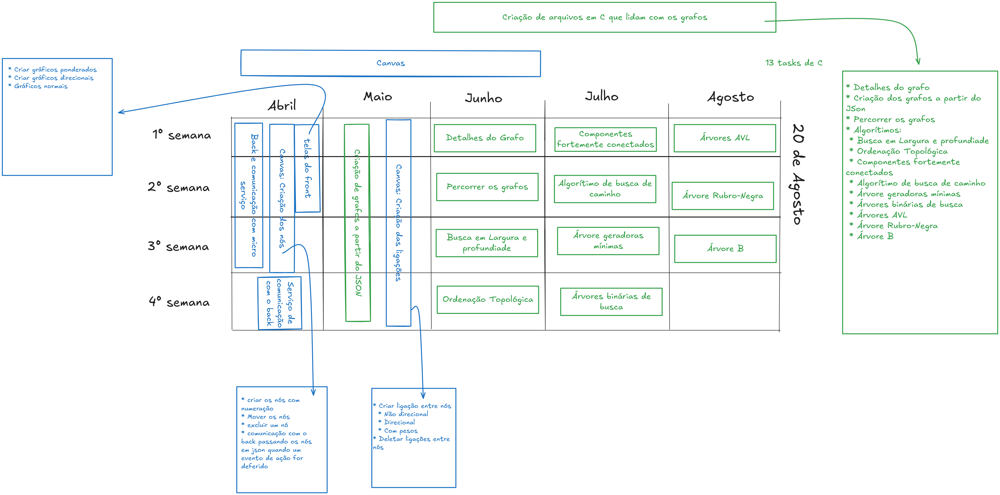

# Tasks

Aqui vai a lista de tarefas de cada um, contudo, vamos todo mundo se ajudar. Assim que um acaba, o outro ajuda na tarefa em progresso.

Kauã:  

* [ ] Criaçaõ do back
* [ ] Criaçaõ do micro serviço que se comunica com os arquivos em c
* [ ] Criação dos nós a partir do json

Gabriel

* [ ] criar os nós com numeração
* [ ]  Mover os nós
* [ ]  Excluir um nó

* [ ] Criar ligação entre nós
  * [ ] Não direcional
  * [ ] Direcional
  * [ ] Com pesos
* [ ] Deletar ligações entre nós

Matheus:

* [ ] Criar Arquitetura do front //**Importante!**
* [ ] Criar componentes gerais do front-end
* Auxílio das tarefas

Tarefas em conjunto:

* [ ]  comunicação com o back passando os nós em json quando um evento de ação for deferido

Arquivos em C:

* [ ] Detalhes do grafo
* [ ] Criação dos grafos a partir do JSon
* [ ] Percorrer os grafos

* [ ] Algorítimos:
  * [ ] Busca em Largura e profundiade
  * [ ] Ordenação Topológica
  * [ ] Componentes fortemente conectados
  * [ ] Algorítimo de busca de caminho
  * [ ] Árvore geradoras mínimas
  * [ ] Árvores binárias de busca
  * [ ] Árvores AVL
  * [ ] Árvore Rubro-Negra
  * [ ] Árvore B

## Tasks Image

